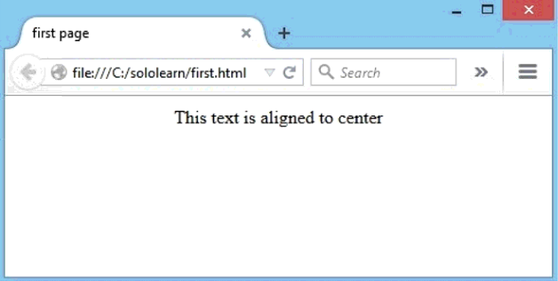

# 简介

现代网页设计的三驾马车：

- HTML Structure
- CSS Presentation
- JavaScript Behavior

HTML 是创建网页的标准标记语言。

- HTML 是 "Hyper Text Markup Language" 的缩写，即超文本标记语言
- HTML 描述网页的结构
- HTML 包含一系列的元素
- HTML 元素（element） 告诉浏览器如何显示对应的内容
- HTML 元素通过标签表示
- 浏览器不显示标签，而是根据标签格式化内容的显示

一个简单的HTML 文档：

```html
<!DOCTYPE html>
<html>
<head>
<title>Page Title</title>
</head>
<body>

<h1>My First Heading</h1>
<p>My first paragraph.</p>

</body>
</html>
```

HTML 文件是一个三明治结构，首尾都有 `<html>` 标签。上面文件包含的标签：

- `<!DOCTYPE html>` 声明该文件是 HTML 文件
- `<html>` 是 HTML 文件的根元素
- `<head>` 包含文档相关的元信息，一些不可见的信息。
- `<title>` 指定 HTML 文档的标题。
- `<body>` 包含页面可见的内容，在 `<head>` 后面。
- `<h1>` 定义最大的标题
- `<p>` 定义段落
- HTML 文件后缀 `.html` 或 `.htm`。

## HTML 属性

属性为元素提供了额外的信息，在元素的 start tag 中指定。大部分属性都有对应的值：

```html
<p align="center">
   This text is aligned to center
</p>
```

其中 `align` 的 "center" 值表示段落的内容居中：

