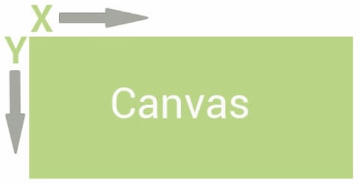

# Canvas

## Introduction

`<canvas>` 可以理解为画板，在去上可以绘制各种复杂的图形。定义也简单：

```html
<canvas id="canvas1" width="200" height="100">
</canvas>
```

`<canvas>` 是画板，也仅仅是画板，在其上绘制什么图形需要自己添加。

`<canvas>` 需要一个 `id` 属性方便 JavaScript 代码引用。

```html
<html>
   <head></head>
   <body>
     <canvas id="canvas1"
   width="400" height="300"></canvas>

   <script>
      var can = document.getElementById("canvas1");
      var ctx = can.getContext("2d");
   </script>

   </body>
</html>
```

`getContext()` 返回当前绘制 context。

## 坐标系

HTML canvas 是一个二维的方格，坐标系如下：



## Rectangle

`fillRect(x, y, w, h)` 用于填充一个矩形。

```js
var c=document.getElementById("canvas1");
var ctx=c.getContext("2d");
ctx.fillRect(20,20,100,100);
```

`fillStyle` 属性用于设置填充颜色：

```js
var canvas=document.getElementById("canvas1");
var ctx=canvas.getContext("2d");
ctx.fillStyle ="rgba(0, 200, 0, 1)";
ctx.fillRect (36, 10, 22, 22);
```

### Line

- moveTo(x,y): Defines the starting point of the line.
- lineTo(x,y): Defines the ending point of the line.

### Circle

- beginPath(): Starts the drawing.
- arc(x,y,r,start,stop): Sets the parameters of the circle.
- stroke(): Ends the drawing.

### Gradient

- createLinearGradient(x,y,x1,y1): Creates a linear gradient.
- createRadialGradient(x,y,r,x1,y1,r1): Creates a radial/circular gradient.

### Text

- Font: Defines the font properties for the text.
- fillText(text,x,y): Draws "filled" text on the canvas.
- strokeText(text,x,y): Draws text on the canvas (no fill).

## Canvas vs. SVG

Canvas

- Elements are drawn programmatically
- Drawing is done with pixels
- Animations are not built in
- High performance for pixels-based drawing operations
- Resolution dependent
- No support for event handlers
- You can save the resulting image as .png or .jpg
- Well suited for graphic-intensive games

SVG

- Elements are part of the page's DOM (Document object model)
- Drawing is done with vectors
- Effects, such as animations are built in
- Based on standard XML syntax, which provides better accessibility
- Resolution independent
- Support for event handlers
- Not suited for game applications
- Best suited for applications with large rendering areas (for example, Google Maps)

You can actually use both SVG and canvas on the same page, if needed.
However, you cannot just draw SVG onto a canvas, or vice-versa.

## Canvas Transformations

- `translate(x,y)` 可以移动 Canvas
- `rotate()` 旋转 Canvas

如，旋转矩形 25 度：

```js
ctx.fillStyle = "#FF0000";
ctx.fillRect(10,10, 100, 100);

ctx.rotate( (Math.PI / 180) * 25);  //rotate 25 degrees.

ctx.fillStyle = "#0000FF";
ctx.fillRect(10,10, 100, 100);
```

The `scale()` method scales the current drawing. It takes two parameters:

- The number of times by which the image should be scaled in the X-direction.
- The number of times by which the image should be scaled in the Y-direction.

