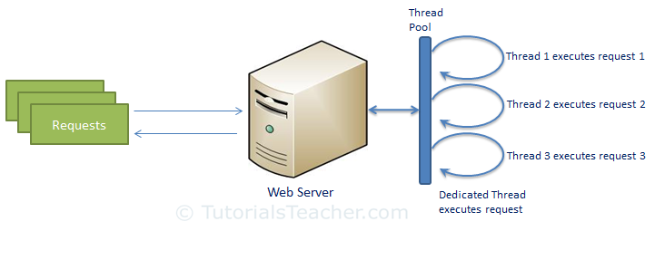
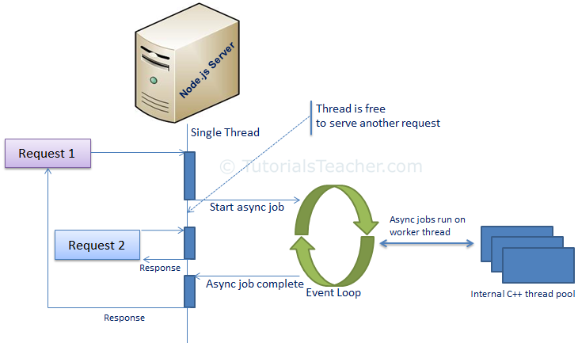

# Node.js

- [Node.js](#nodejs)
  - [简介](#简介)
  - [Node.js Process Model](#nodejs-process-model)
    - [传统网络服务器模型](#传统网络服务器模型)
    - [Node.js 模型](#nodejs-模型)
  - [安装](#安装)
  - [Node.js Console](#nodejs-console)

## 简介

Node.js 是基于 Chrome 的 V8 JavaScript 引擎构建的开源服务器端 JavaScript runtime 环境。提供了事件驱动的非阻塞（异步）I/O和跨平台运行时环境。

Node.js 可用于构建不同类型的程序，包括命令行程序、Web 应用、实时聊天程序等，不过它主要用于构建网络程序，如 Web 服务器，类似于PHP，Java 或 ASP.NET。

[Node.js Github 地址](https://github.com/nodejs/node)

Node.js 的优点：

- Node.js 是 MIT license 下的开源框架
- 完全 JavaScript 构建真个服务器端应用
- 轻量级的框架，包含尽可能少的模块
- 默认异步执行，因此比其它框架更快
- 跨平台

## Node.js Process Model

### 传统网络服务器模型

在传统的网络服务器中，每个请求由线程池中专用线程处理。如果线程池中没有可用线程，则请求阻塞直到有可用线程。线程执行特定请求，完成任务后返回线程池。



### Node.js 模型

Node.js 处理用户请求的方式和传统服务器有所不同。Node.js 在单进程运行，应用在单线程运行，因此使用的资源更少。所有用户请求由单线程处理，所有的I/O或耗时任务异步执行。因此，单线程不需要等待请求完成就可以处理下一个请求。

有一个专用事件循环监视异步任务，在异步任务完成时指定对应的回调函数。Node.js 内部使用 `libev` 进行事件循环，该工具内部使用 C++ 提供异步 I/O。



Node.js 提高了性能和灵活性。不过 Node.js 不适合执行 CPU 密集型操作，如图像处理或其它繁重的计算任务，因为它需要时间处理这类请求，从而导致单线程阻塞。

## 安装

Node.js 开发环境需要如下工具：

- Node.js
- Node Package Manager (NPM)
- IDE or TextEditor

NPM 集成在 Node.js 中，所以无需单独安装。

Node.js 安装很简单，安装后可以通过 `node -v` 验证是否安装成功。

## Node.js Console

打开命令行，运行 `node` 启用 REPL。

在其中可以测试任何 Node.js/JavaScript 表达式。

运行外部脚本：

```cmd
node example.js
```

两次 Ctrl+C 退出。

常用命令（进入 node 后）

|REPL Command|Description|
|---|---|
|.help|显示命令帮助信息|
|.break|Exit from multiline expression|
|.clear|Alias for .break|
|.editor|Enter editor mode|
|.exit|Exit the repl|
|.load|load js from a file into REPL session|
|.save|save all evaluated commands in this REPL session|
