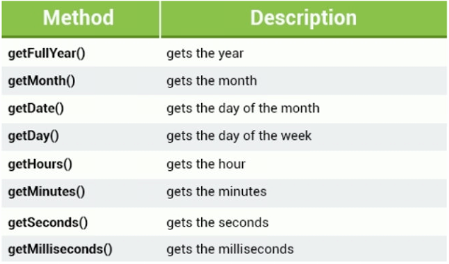

# Date Object

## 创建 Date

- 创建当前日期和时间的 date object:

```js
var d = new Date();
//d stores the current date and time
```

- 以指定日期时间创建

```js
new Date(milliseconds)
new Date(dateString)
new Date(year, month, day, hours, minutes, seconds, milliseconds)
```

> JavaScript dates are calculated in milliseconds from 01 January, 1970 00:00:00 Universal Time (UTC). One day contains 86,400,000 millisecond.
> JavaScript counts months from 0 to 11. January is 0, and December is 11.
Date objects are static, rather than dynamic. The computer time is ticking, but date objects don't change, once created.

## Date 方法



## setInterval

`setInterval` 方法在指定时间内周期内调用函数或计算表达式，直到窗口关闭或者 `clearInterval()` 被调用。

```js
function myAlert() {
   alert("Hi");
}
setInterval(myAlert, 3000);
```

每 3 秒调用一次 `myAlert()` 函数。注意，在其中引用的函数不需要加括号。
